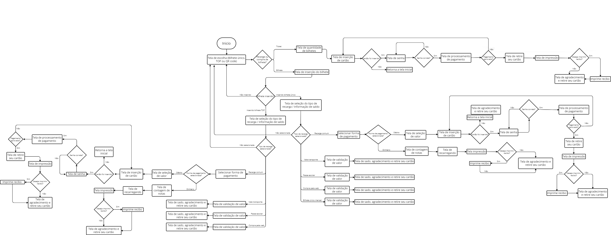
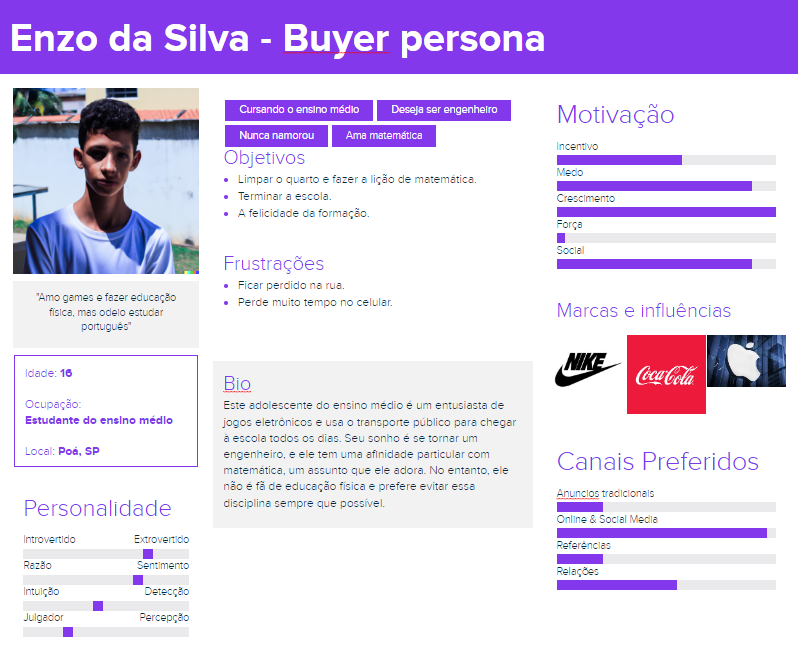
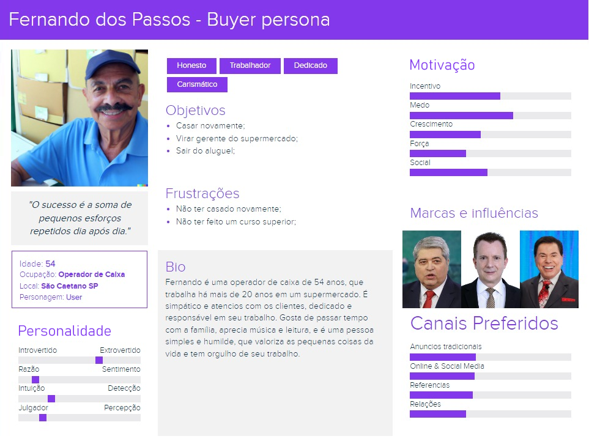
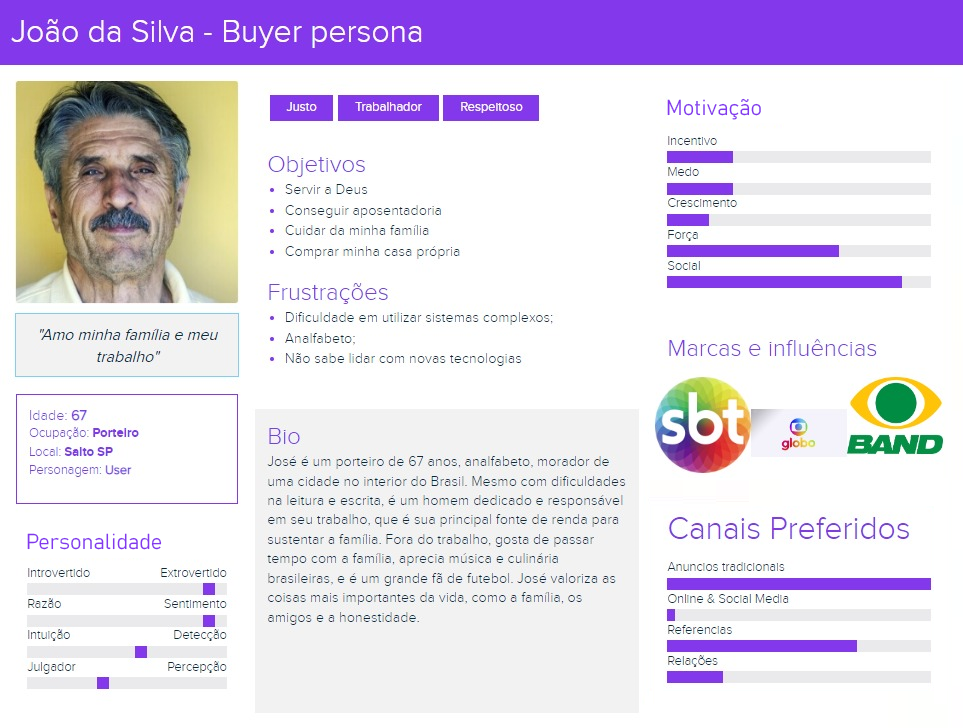
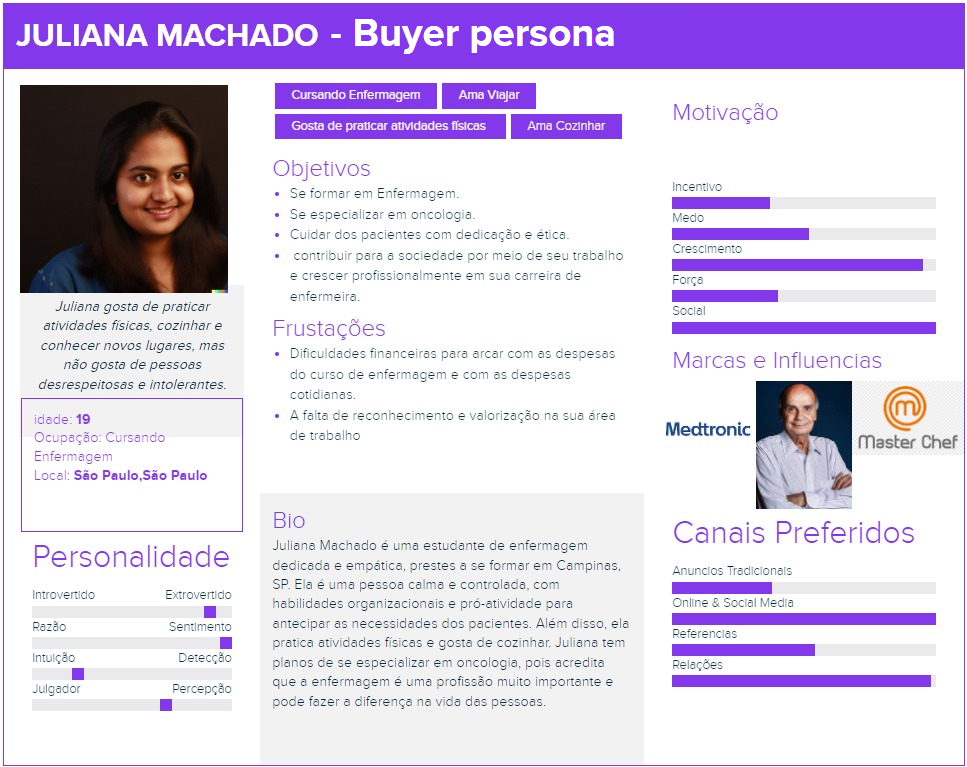
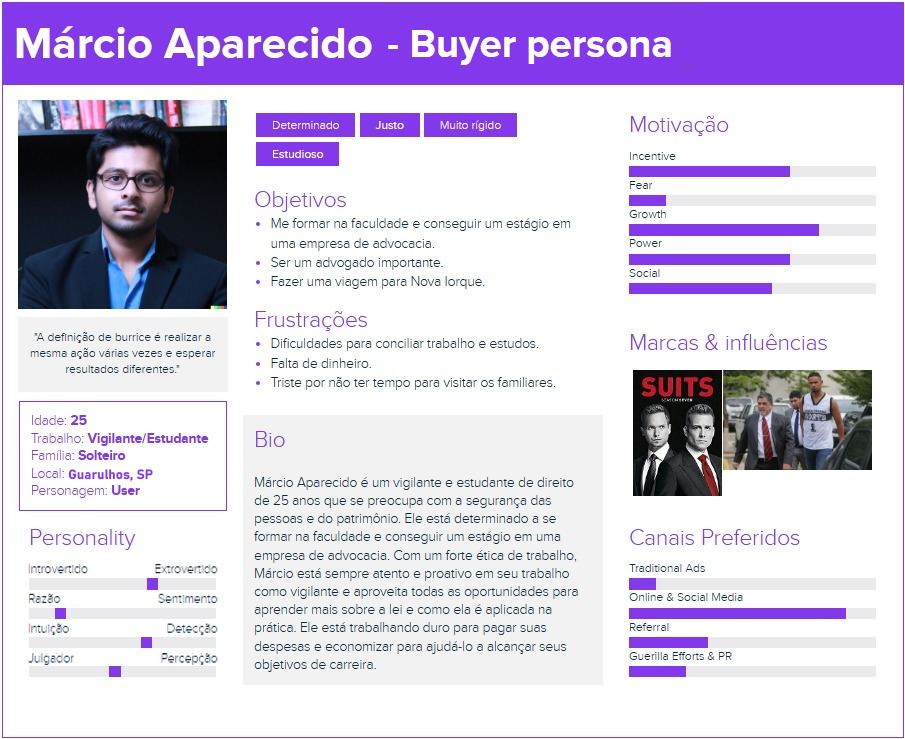
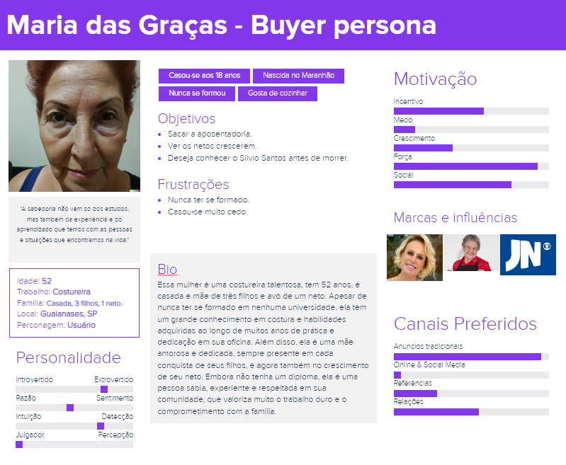
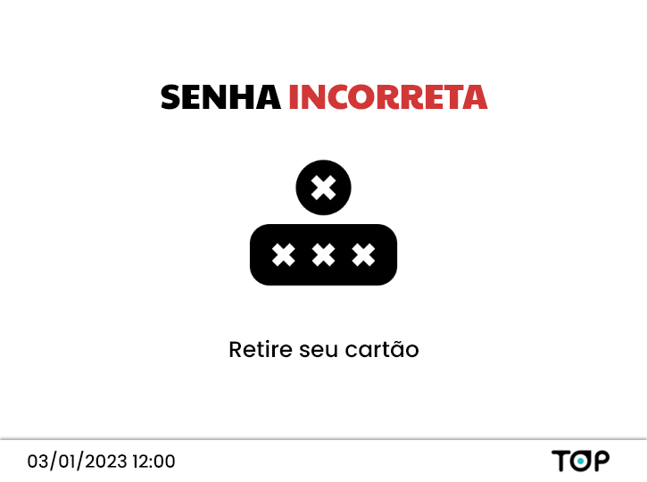
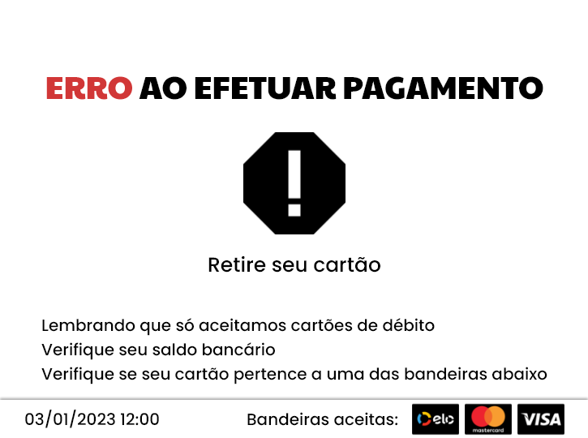

# Índice/Sumário

* [Apresentação](#apresentacao)
* [Arquivos](#arquivos)
* [Fluxograma](#fluxograma)
* [Personas](#personas)
* [Cenários](#cenarios)
* [Protótipos](#prototipos)
    * [Protótipo lo-fi](#lofi)
        * [Passagens QR-Code](#l-qr-code)
        * [Bilhete Único - Débito](#l-bilhete-debito)
        * [Bilhete Único - Dinheiro](#l-bilhete-dinheiro)
        * [Cartão TOP - Débito](#l-top-debito)
        * [Cartão TOP - Dinheiro](#l-top-dinheiro)
    * [Protótipo hi-fi](#hifi)
        * [Passagens QR-Code](#qr-code)
        * [Bilhete Único - Débito](#bilhete-debito)
        * [Bilhete Único - Dinheiro](#bilhete-dinheiro)
        * [Cartão TOP - Débito](#top-debito)
        * [Cartão TOP - Dinheiro](#top-dinheiro)
        * [Passe Escolar](#passe-escolar)
        * [Vale-transporte](#vale-transporte)
        * [Telas de erro](#erros)
* [Heurística de Nielsen](#nielsen)
* [Projeto codificado](#codificado)
* [Autores](#autores)
* [Licença](#licenca)

---

<h1 id="apresentacao"> Apresentação </h1>
Este projeto trata-se de um redesign completo do sistema utilizado pelas ATMs (Máquinas de autoatendimento) do TOP, que é produto da empresa Autopass, utilizado no transporte público de São Paulo.

Para conferir nosso projeto finalizado, [clique aqui](https://www.youtube.com/watch?v=IG1jPeyNzkE).

---

<h1 id="arquivos"> Arquivos </h1>

Para acessar todos os arquivos de desenvolvimento desse projeto, [clique aqui](https://drive.google.com/drive/folders/1HAyTaeQx_TM2DxuZbZSMoPpxuxkG8Dwz?usp=sharing).

---
 

<h1 id="fluxograma"> Fluxograma </h1>

---
 

<h1 id="personas"> Personas </h1>

---
 

<h1 id="cenarios"> Cenários </h1>

### **Enzo da Silva**
Enzo da Silva é um estudante do ensino médio, que todos os dias acorda cedo, toma café e se arruma para ir à escola. Hoje ele se dirigiu ao ponto de ônibus mais perto de sua casa, e chegando lá se pensou “Hoje é o primeiro dia do mês, devo recarregar meu passe de estudante”.

O ônibus de Enzo chega, ele embarca, utiliza seu passe de estudante e se assenta próximo a janela. Ao chegar no terminal mais próximo de sua escola, Enzo se dirige até um dos ATMs disponíveis e, seguindo as instruções na tela, realiza a recarga de seu passe livre.

A recarga foi rápida, porém ao olhar o horário no relógio da ATM após sua recarga, Enzo percebe que precisa correr, pois está atrasado para entrar em sua primeira aula. Ele então acelera o passo em direção a sua escola, e chega a tempo. E a primeira coisa que Enzo pensa quando chega a escola é “Ufa, ainda bem que minha recarga foi rápida e não encontrei nenhuma fila”. 

---

### **Fernando dos Passos**
Fernando dos Passos é um operador de caixa de 54 anos que trabalha em uma loja de departamento em São Paulo. Ele recebe seu vale-transporte da empresa no cartão TOP, que é fornecido pelo empregador. Todas as manhãs, Fernando acorda cedo para se preparar para o trabalho. Ele toma um café da manhã rápido em casa e em seguida, pega o ônibus próximo à sua residência. Para entrar no ônibus, ele simplesmente passa o cartão TOP na catraca, sem precisar de dinheiro em espécie.

Ao longo do trajeto, Fernando aproveita para relaxar e se preparar mentalmente para o dia de trabalho. Ele gosta de ouvir música ou ler um livro durante a viagem. Após chegar ao ponto final do ônibus, Fernando caminha por cerca de 10 minutos até a loja onde trabalha. Quando chega lá, ele usa novamente o cartão TOP para entrar no metrô e completar o trajeto até a estação mais próxima de sua loja. No final do expediente, ele faz o caminho de volta para casa usando  cartão TOP.

Ao longo do mês, Fernando recebe o benefício de vale-transporte em seu cartão TOP e verifica regularmente o saldo disponível nos ATMS da TOP. Ele se certifica de que tem créditos suficientes para cobrir seus custos com transporte e, caso seja necessário, solicita uma recarga adicional.

Graças ao cartão TOP e ao vale-transporte fornecido pela empresa, Fernando tem uma maneira conveniente e fácil de se deslocar para o trabalho sem precisar se preocupar com dinheiro em espécie ou com o pagamento de tarifas separadas para cada modo de transporte utilizado.

---

### **João da Silva**
João da Silva, nasceu em General Maynard, interior de Sergipe, veio para São Paulo, aos 17 anos, em busca de uma oportunidade de trabalho. Trabalhou desde muito jovem para poder ajudar financeiramente sua família, por conta disso, não teve oportunidade para estudar. Todos os dias, acorda de manhã e se prepara para ir para seu trabalho, pega sua marmita, que sua esposa prepara, para poder se alimentar no seu local de trabalho, assim João consegue economizar algum dinheiro. Ao sair de casa João dirige-se até o ponto de ônibus mais próximo de sua residência, com destino ao terminal, para poder pegar outro ônibus e descer próximo ao seu local de trabalho. Ele recebe seu vale-transporte da empresa no cartão TOP, que é fornecido pelo empregador. Ao chegar no terminal, João não necessita auxílio de pessoas para poder realizar a consulta de saldo e/ou recarga, pois para ele o sistema é intuitivo, mesmo com sua limitação pessoal.

---

### **Juliana Machado** 
Juliana Machado é uma estudante de 19 anos que está  no ultimo semestre do curso de enfermagem. Por conta de não ter um emprego passa muitas dificuldades financeira, já que depende dos seus pais pra tudo financeiramente. Juliana recebe mensalmente um valor fornecido por seu pai para que ela possa recarregar seu cartão TOP.

Juliana costuma acordar 11 horas pois estuda a noite e costuma dormir tarde, já que chega em casa quase meia noite, Sendo assim, aproveita pra estudar um pouco antes de dormir. Logo após acordar ela aproveita pra ver um pouco sobre as notícias e blogs de viagem. Em torno das 14 horas Juliana almoça e vai fazer seus deveres em casa, após terminar costuma estudar até dar 17:00. Começa a se arrumar e sai de casa por volta de 17:30 para que possa chegar a tempo na faculdade. Hoje Juliana terá que recarregar seu cartão TOP.

 Assim, Juliana sai de casa e pega o ônibus já que o ponto fica logo em frente sua casa. Após 30 minutos ela chega na sua estação de trem. Saindo da estação, ela lembra que precisa recarregar seu Cartão TOP, ela volta e vai até um ATM para fazer a recarga. Chegando percebe que existe uma fila com 10 pessoas, mas fica feliz pelo sistema ser simples e autoexplicativo, sendo muito rápido. Em 10 minutos de espera chega a sua vez e recarrega seu Cartão TOP em dinheiro.Após a recarga Juliana sai correndo pois ainda precisa pegar outro trem e mais um ônibus para chegar na sua faculdade. No entanto, Juliana sai aliviada de ter feito sua recarga com rapidez

---

### **Maria das graças**
Maria das Graças, é nascida em São Paulo, casada, sua profissão é costureira. Maria trabalha em uma fábrica de roupas, onde faz peças de roupa em jeans. Para conseguir ir até o trabalho Maria recebe seu vale-transporte no cartão TOP. Maria, acorda muito cedo para poder chegar ao trabalho no horário, Maria sai de casa por volta das 05h vai até o ponto de ônibus que fica na esquina de sua casa, após chegar ao ponto final do ônibus, Maria precisa fazer uma caminhada por cerca de 5 minutos, até a estação do metrô para completar seu trajeto até a estação mais próxima do seu local de trabalho. Maria acompanha o saldo do seu cartão pelo aplicativo TOP, e se necessário realiza a consulta do saldo disponível nos ATMs da TOP. Ela se certifica quase que diariamente se possui créditos suficientes para cobrir seus custos com o transporte, caso haja necessidade, ela solicita uma recarga adicional. Maria se sente muito confortável utilizando o cartão TOP e o vale-transporte fornecido pela sua empresa, pois possui uma maneira muito prática e fácil para se deslocar de casa até o trabalho sem ter preocupação em carregar dinheiro no seu trajeto.

---

### **Márcio Aparecido**
Márcio Aparecido é um jovem vigilante de 25 anos que trabalha em uma empresa de segurança em São Paulo. Ele recebe seu vale-transporte da empresa no cartão Top, que é fornecido pelo empregador. Além disso, ele é um estudante universitário de Direito e tem direito a um vale-estudante, que lhe permite pagar meia-tarifa em alguns meios de transporte público.

Para carregar seu cartão Top com os créditos do vale-transporte e do vale-estudante, Márcio costuma utilizar as ATMs do bilhete Top disponíveis em alguns pontos da cidade. Ele seleciona a opção de carregar o cartão com o valor necessário para o mês e, em seguida, insere dinheiro na máquina para pagar pelos créditos.

Dessa forma, Márcio tem a praticidade de recarregar seu cartão Top de forma rápida e fácil, sem precisar se deslocar até um posto de venda ou esperar na fila. Além disso, ele consegue adicionar tanto os créditos do vale-transporte quanto do vale-estudante em um único cartão, o que lhe proporciona uma gestão mais eficiente dos seus gastos com transporte.

Márcio também tem a opção de carregar seu cartão Top pela internet ou por meio de aplicativos móveis, mas ele prefere utilizar as ATMs do bilhete Top porque considera que é mais seguro e confiável. Em geral, ele faz as recargas no início de cada mês para garantir que sempre tenha créditos disponíveis para suas viagens. Com isso, Márcio consegue se locomover com praticidade e economia, seja para o trabalho ou para a universidade.

---
 

<h1 id="prototipos"> Protótipos </h1>

<h2 id="lofi"> Protótipo de Baixa Fidelidade (lo-fi) </h2>

Protótipos de Baixa Fidelidade (ou lo-fi, do inglês low-fidelity) são modelos simples e rápidos que representam uma ideia ou conceito em um estágio inicial de desenvolvimento.

Para acessar nosso protótipo lo-fi completo [**clique aqui**](https://www.figma.com/file/WQ02U8DxxjUd1kDMp2kxE7/Prot%C3%B3tipo-lo-fi-ATMs?type=design&node-id=0%3A1&t=sUkycMKrzXsPCixQ-1) (Figma).

**Nosso protótipo:**

<h3 id="l-qr-code"> Passagens QR-Code</h2>

---

<h3 id="l-bilhete-debito"> Bilhete Único - Débito</h2>

---

<h3 id="l-bilhete-dinheiro"> Bilhete Único - Dinheiro</h2>

---

<h3 id="l-top-debito"> Cartão TOP - Débito</h2>

---

<h3 id="l-top-dinheiro"> Cartão TOP - Dinheiro</h2>

---

<h2 id="hifi"> Protótipo de Alta Fidelidade (hi-fi) </h2>

Protótipos de Alta Fidelidade (ou hi-fi, do inglês high-fidelity) são modelos mais refinados e detalhados que simulam com maior precisão as funcionalidades e interações do produto ou sistema final.

Para acessar nosso protótipo hi-fi completo [**clique aqui**](https://xd.adobe.com/view/2816a9e6-ed8f-4530-b993-92577773db29-7d45/) (Visualizador do Adobe XD).

**Nosso protótipo:**

<h3 id="qr-code"> Passagens QR-Code</h2>

---

<h3 id="bilhete-debito"> Bilhete Único - Débito</h2>

---

<h3 id="bilhete-dinheiro"> Bilhete Único - Dinheiro</h2>

---

<h3 id="top-debito"> Cartão TOP - Débito</h2>

---

<h3 id="top-dinheiro"> Cartão TOP - Dinheiro</h2>

---

<h3 id="passe-escolar"> Passe escolar</h2>

---

<h3 id="vale-transporte"> Vale-transporte</h2>

---
<h3 id="erros"> Telas de erro</h2>

---
 

<h1 id="nielsen"> Heurística de Nielsen </h1>

Existem dez heurísticas criadas por Jakob Nielsen, cientista da computação, que ajudam a projetar uma boa interface e por consequência uma ótima experiência de uso. E nós utilizamos essas regras para uma análise de nosso sistema.

Para conferir nossa análise heurística, [clique aqui](https://drive.google.com/file/d/1IBOjluMOdi1v3OJbo_RWUBXmCXQB1zXv/view?usp=sharing).

---

<h1 id="codificado"> Projeto codificado </h1>

Acesse o código de nosso projeto, através de nosso repositório no Github. Para fazer isto, [clique aqui](https://github.com/cmatt7/autopass-A3).

Para o desenvolvimento do projeto utilizamos: HTML, CSS, JavaScript, Vue.js e Tailwind. 

---

<h1 id="autores"> Autores </h1>

Aluno | RA 
:--- | :---: 
Rafael Soares Cardozo | 1222133018
Matheus Cruz | 8222243702
Thiago Schott | 10722127490
Rennan Silva | 823124657
Nicolas Coiado | 822149637
Adiel Dornelas | 823132986
---
 

<h1 id="licenca"> Licença </h1>

Este projeto está licenciado sob a Licença MIT,  consulte o arquivo [LICENCE](./LICENSE) para mais detalhes.
